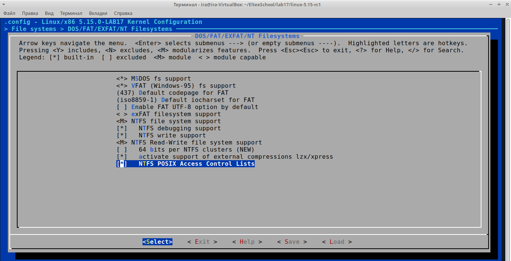

## Лабораторная работа 17 "Сборка ядра"

* Сначала установим необходимые зависимости:
```bash
sudo apt install git fakeroot build-essential ncurses-dev xz-utils libssl-dev bc flex libelf-dev bison -y
```

* Через команду
```bash
uname -r
```
выясним версию ядра:
```
ira@ira-VirtualBox:~/EltexSchool/lab17$ uname -r
5.15.0-122-generic
```

* Загрузим исходники ядра:
```bash
wget https://git.kernel.org/pub/scm/linux/kernel/git/torvalds/linux.git/snapshot/linux-5.15-rc1.tar.gz
```

* Распакуем исходники ядра:
```bash
tar -xf linux-5.15-rc1.tar.gz
```

* Заменим значение EXTRAVERSION для выделения "нашей" конфигурации
```Makefile
EXTRAVERSION = -LAB17
```

* В распакованной папке соберём дефолтную конифгурацию
```bash
make defcofnig
```

* Для удобного управления опциями откроем menuconfig
```bash
make menuconfig
```

* В качестве изменения добавим поддержку NTFS


* Запустим сборку сжатого ядра на 4 потоках
```bash
make -j4 bzImage
```
После успешной сборки получаем сообщение:
```
Kernel: arch/x86/boot/bzImage is ready  (#1)
```

* Запустим сборку модулей ядра
```bash
make modules
```

