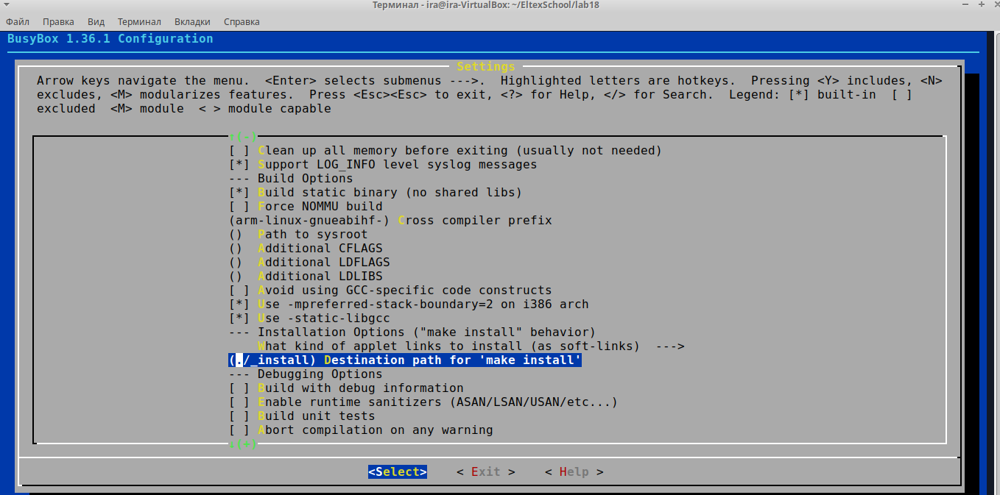
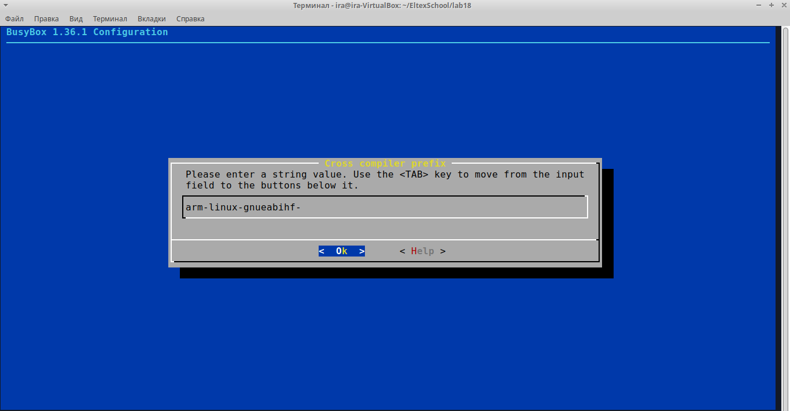
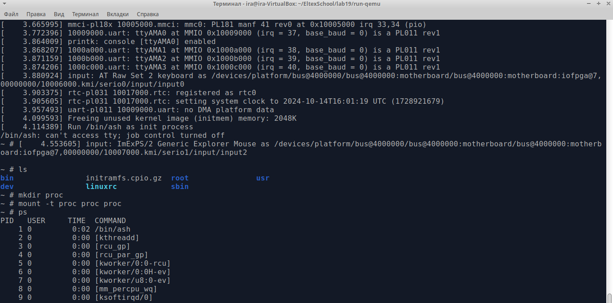

## Лабораторная 18 "Сборка rootfs"

* Скачаем и распакуем исходники busybox
```bash
echo LAB18: Download busybox sources
wget https://busybox.net/downloads/busybox-1.36.1.tar.bz2

echo LAB18: Unpack sources
tar -xf busybox-1.36.1.tar.bz2
```

* Подготовим конфигурацию
```bash
echo LAB18: Make config ARM
ARCH=arm make defconfig
ARCH=arm make menuconfig
```
В опциях компиляции выберем "Build static binary"


Далее добавим префикс для кросс-компиляции


* Сборка
```bash
make -j4
```

* Убедимся что полученный бинарь под ARM
```bash
file busybox | grep ARM | grep statically
```

* Установка busybox
```bash
make install
cd _install
```

* Соберём архив с начальной ФС (rootfs)
```bash
find . | cpio -o -H newc | gzip > initramfs.cpio.gz
```

* Переместим этот архив в папку для запуска эмулятора лаб. 19 (предварительно собрана)
```bash
cp initramfs.cpio.gz ../../../lab19/run-qemu/
```

* В папке для запуска эмулятора выполним команду из лаб. 19, но с дополнительными опциями
```bash
QEMU_AUDIO_DRV=none qemu-system-arm -M vexpress-a9 -kernel zImage -dtb vexpress-v2p-ca9.dtb -append "console=ttyAMA0 rdinit=/bin/ash" -nographic -initrd initramfs.cpio.gz
```

* После запуска выполним команду ps
Она не выведет данные, т.к. отсутствует точка procfs для отображения текущих процессов.
После монтирования выполняется корректно

